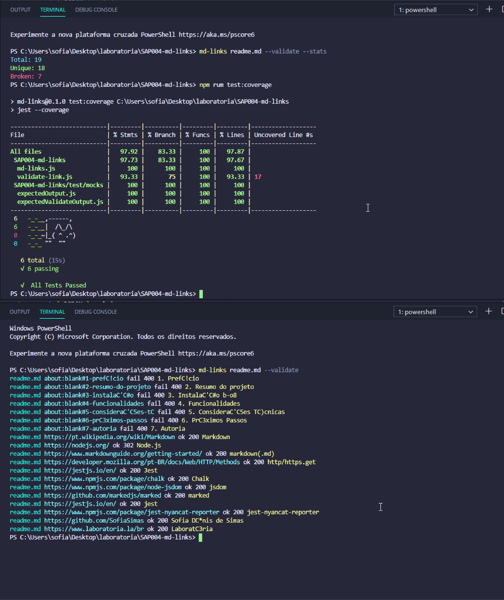

# Markdown Links

## Índice

* [1. Prefácio](#1-prefácio)
* [2. Resumo do projeto](#2-resumo-do-projeto)
* [3. Instalação ⭐️](#3-instalação)
* [4. Funcionalidades](#4-funcionalidades)
* [5. Considerações Técnicas](#5-considerações-técnicas)
* [6. Próximos Passos](#6-próximos-passos)
* [7. Autoria](#7-autoria)

***

## 1. Prefácio

[Markdown](https://pt.wikipedia.org/wiki/Markdown) é uma linguagem de marcação
muito popular entre os programadores. É usada em muitas plataformas que
manipulam texto (GitHub, fórum, blogs e etc) e é muito comum encontrar arquivos
com este formato em qualquer repositório (começando pelo tradicional
`README.md`).

Os arquivos `Markdown` normalmente contém _links_ que podem estar
quebrados, ou que já não são válidos, prejudicando muito o valor da
informação que está ali.

Uma comunidade open source nos propôs criar uma ferramenta, usando
[Node.js](https://nodejs.org/), que leia e analise arquivos no formato
`Markdown`, para verificar os arquivos que contenham links e mostrar algumas
estatísticas.

## 2. Resumo do projeto

### Biblioteca md-links

O md-links é uma biblioteca que lê arquivos no formato [markdown(.md)](https://www.markdownguide.org/getting-started/) e retorna os links encontrados neles, apresentando, validações e estados se ainda desejar.

Neste projeto você criará uma ferramenta de linha de comando (CLI) assim como a
sua própria biblioteca (library) em JavaScript.

## 3. Instalação ⭐️

Para instalação global do projeto, execute no terminal:

`npm install -g SofiaSimas/SAP004-md-links`

## 4. Funcionalidades

Quando requisitada, a biblioteca necessita de alguns parâmetros, opcionais ou não.

Após a instalação, poderá utilizar path para a rota da pasta ou arquivo:

md-links `<path-to-file>`

* `options`: Um objeto com a seguinte propriedade:
  - `validate`:(Opcional) Para verificar o status
  - `stats`:(Opcional) Para verificar as estatísticas

## 5. Considerações Técnicas

* [http/https.get](https://developer.mozilla.org/pt-BR/docs/Web/HTTP/Methods) O método GET solicita a representação de um recurso específico. Requisições utilizando o método GET devem retornar apenas dados.
* [Jest](https://jestjs.io/en/) Para testes.
* [Chalk](https://www.npmjs.com/package/chalk) - Versão 4.1.0
* [jsdom](https://www.npmjs.com/package/node-jsdom) - Versão 16.2.2
* [marked](https://github.com/markedjs/marked) - Versão 1.1.0
* [jest](https://jestjs.io/en/) - Versão 26.1.0
* [jest-nyancat-reporter](https://www.npmjs.com/package/jest-nyancat-reporter) - Versão 2.0.0

## 6. Próximos passos

* Aperfeiçoar os testes,
* Implementar suporte para diretórios e os testes,
* Hacker Edition.

## 7. Autoria

Desenvolvido com ♥️ por [Sofia Dênis de Simas](https://github.com/SofiaSimas), para o Bootcamp da [Laboratória](https://www.laboratoria.la/br)

